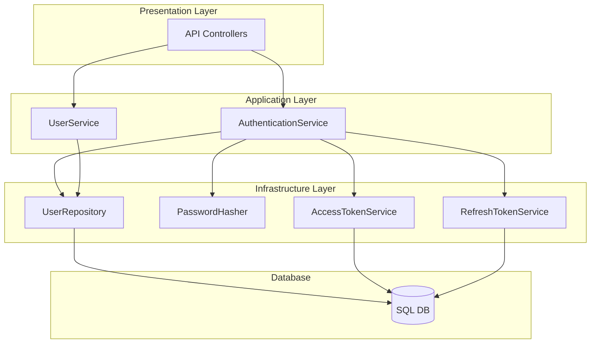
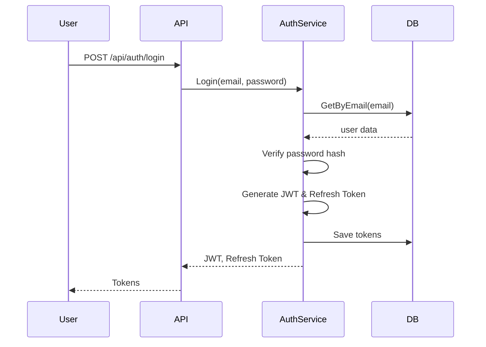
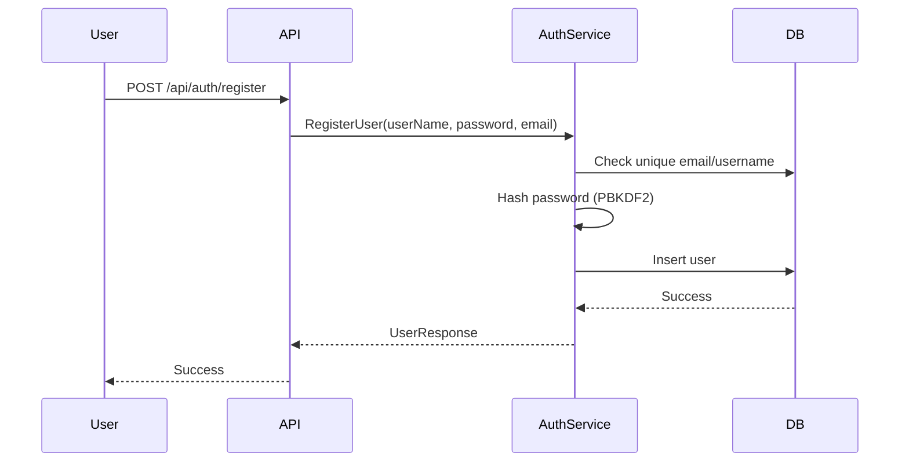
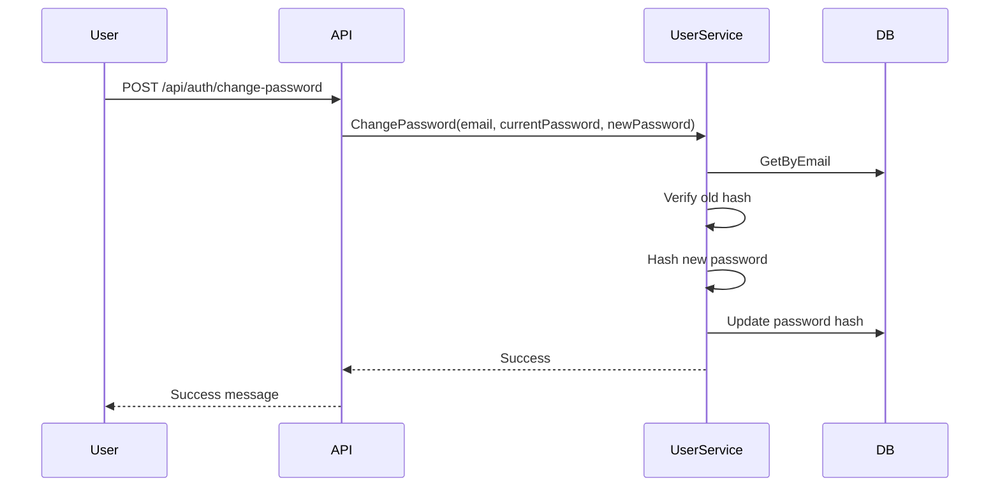

# AuthenticationSystem


> **Built by Ahmed Saleh Ghaithan**  
> Modern, enterprise-ready authentication platform for .NET

---

## 🚀 Overview

This project is a production-grade authentication system built with C#/.NET, demonstrating best practices in security, scalability, and software architecture.  
It includes modular APIs for user registration, login, password reset, and robust JWT-based authorization, all designed for real-world business needs.

---

## 🌟 Why Choose This System?

- **Enterprise Security:** Implements PBKDF2 password hashing, JWT with strong signing, refresh/revoke flows, and role/permission claims.
- **Clean Architecture:** Domain-driven, SOLID-principled codebase, separation of concerns, and extensibility.
- **Modern Stack:** Built with ASP.NET Core, Entity Framework, and the latest .NET features.
- **Scalable:** Easily integrates with microservices, cloud platforms, and CI/CD pipelines.
- **Portfolio-Ready:** Code quality, documentation, and testing suitable for professional review.

---

## 🏗️ System Architecture



---

## 🔐 Authentication & Authorization Flow

### 1. Login



### 2. Registration



### 3. Password Reset



---

## 🛡️ Security Details

### Password Hashing (PBKDF2 + SHA256)
- Each password gets a unique salt and is hashed with 10,000 iterations.
- Based on your code (see `PasswordHasher.cs`):

```csharp
public string Hash(string password)
{
    byte[] salt = RandomNumberGenerator.GetBytes(16);
    byte[] hash = Rfc2898DeriveBytes.Pbkdf2(password, salt, 10000, SHA256, 32);
    return $"{Convert.ToHexString(hash)}-{Convert.ToHexString(salt)}";
}
```
Verification is done with constant-time equality checks.

### JWT Structure
- Claims: Email, Username, JTI, roles, and encoded permissions.
- Signing: HMAC SHA256.
- Configurable lifetimes for access and refresh tokens.

---

## 📦 API Endpoints

| Endpoint                   | Method | Purpose                |
|----------------------------|--------|------------------------|
| /api/auth/login            | POST   | User login             |
| /api/auth/register         | POST   | User registration      |
| /api/auth/refresh          | POST   | Refresh JWT token      |
| /api/auth/revoke           | POST   | Revoke refresh token   |
| /api/auth/change-password  | POST   | Change password        |

---

## 🛠️ Technologies Used

- **Language:** C# (.NET)
- **Framework:** ASP.NET Core Web API
- **Security:** JWT, PBKDF2, HMAC SHA256
- **Database:** Entity Framework Core
- **Architecture:** Clean/Domains-driven
- **Documentation:** Swagger/OpenAPI

---

## 📈 What Makes This Project Unique?

- Security-first, with modern cryptography and tokenization.
- Designed for extensibility (roles, permissions, claims).
- Suitable for SaaS, enterprise systems, or as a learning reference.
- Code quality and documentation aimed at technical hiring managers.

---


## 🏁 Getting Started

1. Clone repo
2. Set JWT and DB config in `appsettings.json`
3. Open package manager console and run `update-database`
4. Run the system
5. Explore endpoints via Swagger UI
